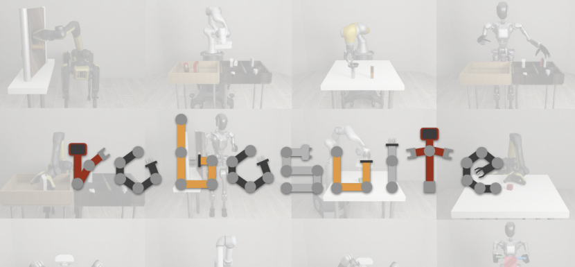

# Reinforcement-Learning-Based-Pick-and-Place-Task-for-Panda-Robot



## Table of Contents

- [Overview](#overview)
- [Features](#features)
- [Prerequisites](#prerequisites)
- [Installation](#installation)
- [Usage](#usage)

## Overview

This project leverages **robosuite**, a simulation framework for robotic manipulation, in combination with **Stable Baselines3 (SB3)** to train and evaluate a Soft Actor-Critic (SAC) agent for the **Pick-and-Place** task. The agent learns to autonomously pick up objects and place them in designated locations within a simulated environment.

## Features

- **Robosuite Integration**: Utilizes the `PickPlace` task in robosuite with the Panda robot.
- **Stable Baselines3 SAC**: Implements the SAC algorithm for efficient and stable training.
- **Model Checkpointing**: Automatically saves the best-performing models during training.
- **GPU Support**: Configured to utilize CUDA-enabled GPUs for accelerated training.
- **Evaluation and Demonstration**: Provides functionalities to evaluate the trained agent and visualize its performance.
- **Customizable Hyperparameters**: Allows tweaking of SAC hyperparameters for optimized performance.

## Prerequisites

- **Operating System**: Windows, macOS, or Linux.
- **Python**: Version 3.8 or higher.
- **CUDA**: If utilizing GPU acceleration, ensure CUDA is installed and compatible with your GPU and PyTorch version.
- **NVIDIA GPU**: A CUDA-capable NVIDIA GPU for hardware acceleration (optional but recommended).

## Installation

Follow the steps below to set up the environment and install all necessary dependencies.

### 1. Clone the Repository

```bash
git clone https://github.com/ChandhanSaai/-Reinforcement-Learning-Based-Pick-and-Place-Task-for-Panda-Robot.git
cd robosuite-sac-pick-place
```
### 2. Create a Conda Environment
```bash
conda create -n robosuite_env python=3.8
conda activate robosuite_env
```
### 3. Install PyTorch with CUDA Support
``` bash
conda install pytorch torchvision torchaudio pytorch-cuda=11.8 -c pytorch -c nvidia
```
### 4. Install robosuite and Dependencies
```bash
conda install -c conda-forge robosuite
pip install stable-baselines3 gymnasium matplotlib robosuite_models
```
## Usage
### 1. Running the Script
```bash
python pick_and_pick_and_place_operation_for_final_project.py
```
Upon running, you'll be prompted to choose an option:
```bash
Choose an option:
1. Continue training from latest model (if available)
2. Start fresh training
3. Evaluate latest model
Enter your choice (1-3):
```
### 2. Training the Agent
- Option 1: Continue Training from Latest Model
If you have previously trained models saved in the trained_models directory, selecting this option will load the latest model and continue training.

- Option 2: Start Fresh Training
Selecting this option will initiate training from scratch without loading any existing models.

- Training Parameters:

  - Total Timesteps: 1,500,000 (can be adjusted in the script).
  - Batch Size: 1024 (adjusted for manageability).
  - Buffer Size: 8,000,000.
  -Learning Rate: 5e-4.
  - Gamma: 0.95.
  - Entropy Coefficient: Automatically adjusted with an initial value of 0.1.
  - Training and Gradient Steps: train_freq=3, gradient_steps=6.
  - Saving Mechanism:

  - Checkpoints: Saved every 5,000 timesteps.
  - Final Model: Saved upon completion of training.
  - VecNormalize Statistics: Saved to ensure consistent normalization during evaluation.
### 3. Evaluating the Agent
- Option 3: Evaluate Latest Model
  - This option evaluates the most recently saved model and runs demonstration episodes with rendering enabled.

- Evaluation Steps:

  - Loading the Model: Loads the latest SAC model from the trained_models directory.
  - Running Evaluation Episodes: Executes 5 episodes to compute the mean and standard deviation of rewards.
  - Demonstration Episodes: Runs 3 episodes with on-screen rendering to visualize the agent's performance.
  - Plotting Results: Displays a plot of rewards from demonstration episodes.
  - Note: Ensure that rendering is enabled in the environment setup for visualization.
